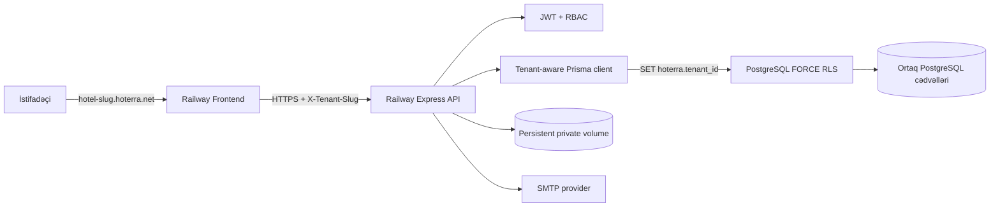
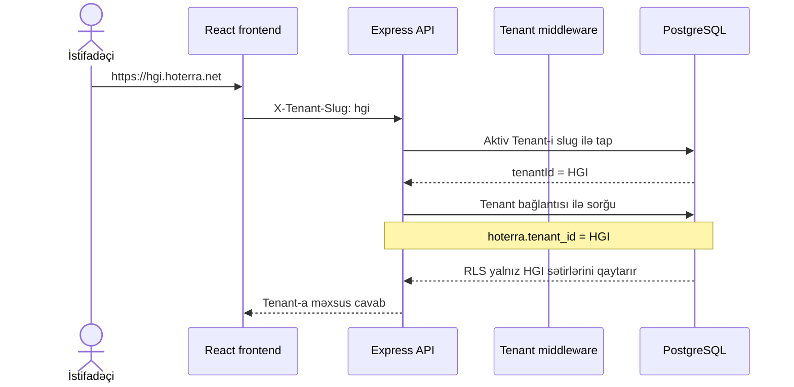
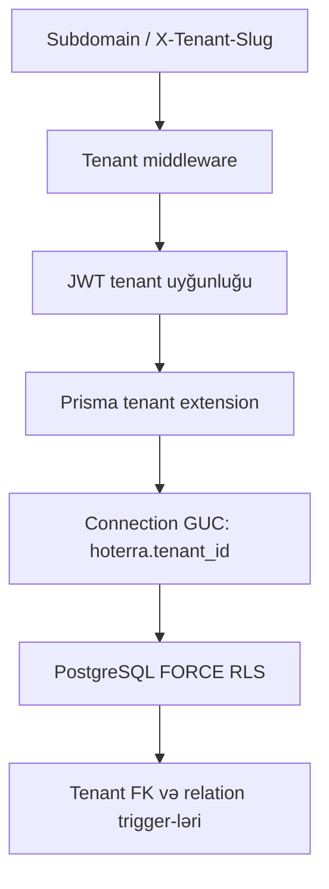
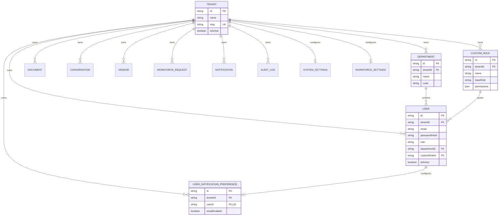
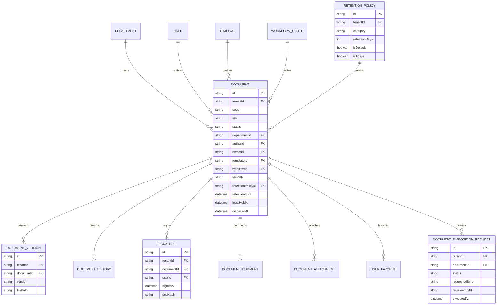
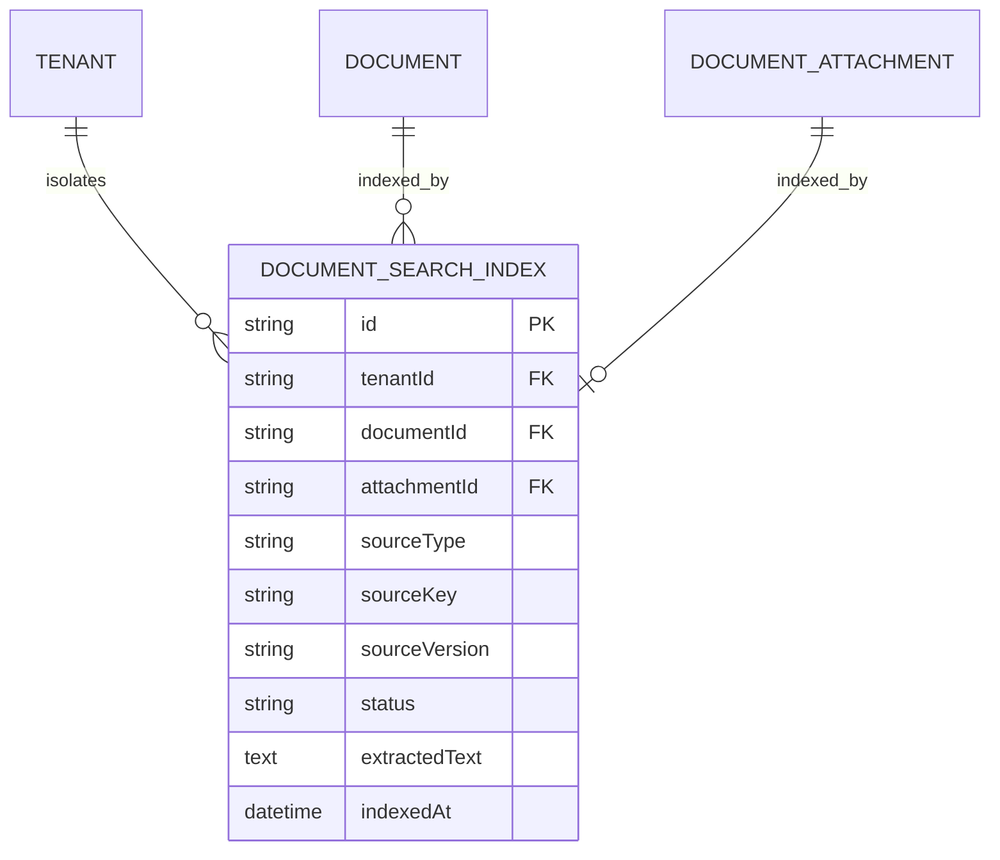
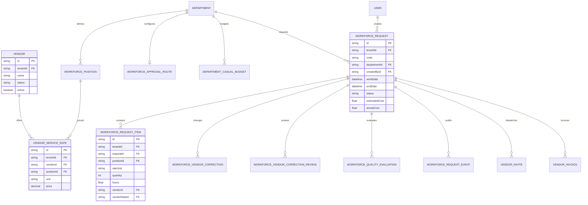
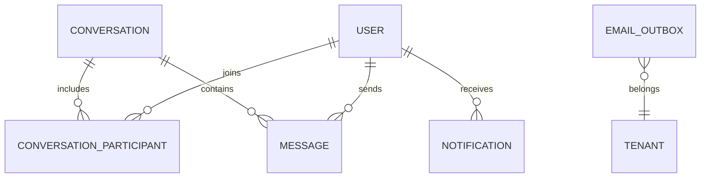

# HOTERRA verilənlər bazasının arxitekturası

Bu sənəd HOTERRA-nın production PostgreSQL sxemini, tenant (otel) izolyasiyasını və əsas biznes əlaqələrini göstərir. Mənbə: `prisma/schema.prisma` və `prisma/migrations`.

## 1. Arxitektura xülasəsi

| Mövzu | Həll |
|---|---|
| Database | PostgreSQL 17 + Prisma ORM |
| Tenant modeli | Bir database, ortaq cədvəllər, hər otel üçün `tenantId` |
| Tenant seçimi | `https://<slug>.hoterra.net` və `X-Tenant-Slug` |
| İzolyasiya | API filtri + PostgreSQL `FORCE ROW LEVEL SECURITY` |
| Əlaqə bütövlüyü | `tenantId NOT NULL`, `Tenant` foreign key-ləri və tenant relation trigger-ləri |
| Unikal sahələr | Tenant daxilində unikal: məsələn `(tenantId, email)` |
| Fayllar | Tenant prefiksli private storage; yalnız seçilmiş login branding şəkilləri public read-only endpointlə verilir |
| Migration | Versionlanmış PostgreSQL migration-ları, production-da `migrate deploy` |

Hazırkı ilkin tenant:

- Otel: Holiday Inn Baku
- Slug: `hgi`
- URL: `https://hgi.hoterra.net`
- ID: `00000000-0000-4000-8000-000000000001`

## 2. Production topologiyası



Frontend və backend ayrıca servisdir. Database migration-ları backend deploy-dan əvvəl admin bağlantısı ilə icra edilir. Runtime backend isə superuser olmayan məhdud `hoterra_app` rolu ilə database-ə qoşulur.

## 3. Tenant necə müəyyən edilir?



Login-dən sonra JWT-də `tenantId` və istifadəçinin `tokenVersion` dəyəri saxlanılır. JWT tenant-ı ilə hostname/header tenant-ı uyğun gəlməzsə sorğu rədd edilir. İstifadəçinin aktivliyi, cari rolu və token versiyası hər qorunan sorğuda database-dən yenidən yoxlanılır. Logout və parol reseti `tokenVersion` dəyərini artıraraq əvvəl verilmiş bütün bearer tokenləri server tərəfində etibarsız edir.

Login branding tenant-a məxsus `SystemSettings.loginLogoPath` və `SystemSettings.loginBackgroundPath` sahələrində saxlanılır. Login-dən əvvəl yalnız aktiv tenant-ın hazırda seçilmiş iki şəkli public branding endpointindən oxuna bilər; ümumi upload qovluğu açıq deyil.

## 4. Müdafiə qatları

Tenant səhvi tək bir mexanizmdən asılı deyil:



- Bütün tenant cədvəllərində `tenantId` məcburidir (`NOT NULL`).
- `tenantId`, `Tenant.id`-yə `ON DELETE RESTRICT` foreign key ilə bağlıdır.
- RLS policy yalnız `current_setting('hoterra.tenant_id')` ilə eyni tenant sətirlərinə icazə verir.
- Runtime rolu PostgreSQL superuser ola bilməz; backend production startup zamanı bunu yoxlayır.
- Cross-tenant `departmentId`, `userId`, `vendorId` kimi əlaqələri ayrıca database trigger-ləri bloklayır.
- Şəxsi notification preference əlaqəsi composite `(tenantId, userId) → User(tenantId, id)` foreign key-i ilə başqa tenant user-inə bağlana bilmir.
- Migration/system bağlantısında kontrollu `hoterra.tenant_id=*` istifadə olunur.

## 5. Ümumi tenant sxemi



Əsas tenant-scope unique indekslər:

```text
Department        (tenantId, name), (tenantId, code)
User              (tenantId, email)
CustomRole        (tenantId, name)
Document          (tenantId, code)
Conversation      (tenantId, directKey), (tenantId, type, departmentId)
WorkforcePosition (tenantId, name)
Vendor            (tenantId, name)
WorkforceRequest  (tenantId, code)
```

Bu yanaşma fərqli otellərdə eyni email, departament kodu, vendor adı və sənəd kodunun istifadə olunmasına imkan verir, eyni otel daxilində təkrarı bloklayır.

## 6. Document Management sxemi



Fayl yolları database-də tenant prefiksi ilə saxlanılır. `/uploads` public static route deyil; sənəd və imza faylları yalnız `/api/files/...` üzərindən JWT, canonical sənəd siyasəti və `/uploads/{activeTenantId}/` storage prefiksi yoxlandıqdan sonra verilir. Reusable istifadəçi imzasını yalnız həmin istifadəçi görə bilər; digər şəxslər yalnız oxumağa icazəli sənəddəki dəyişməz imza sübutunu görür. Login loqosu və fonu `/uploads/{tenantId}/branding/` altında saxlanılır və public API yalnız `SystemSettings`-də aktiv seçilmiş faylı qaytarır.

Records disposition hard-delete etmir: təsdiqlənmiş four-eyes qərardan sonra məzmun və file reference-ləri purge olunur, `Document.status=DISPOSED` metadata tombstone-u, `DocumentDispositionRequest` snapshot-u, history və audit evidence saxlanılır. Partial unique index hər document üçün yalnız bir `PENDING` request-ə icazə verir. `RetentionPolicy` və `DocumentDispositionRequest` tenant cədvəlləridir və `FORCE RLS` ilə qorunur.

`DocumentSearchIndex` hər `Document` üçün bir `PRIMARY` və hər `DocumentAttachment` üçün ayrıca `ATTACHMENT` tenant-scoped extraction sətri saxlayır. `(documentId, sourceKey)` unique invariant-i eyni faylın ikinci indeksini yaratmağa qoymur; attachment silinəndə onun indeksi cascade olunur. Primary file dəyişəndə köhnə mətn dərhal silinir və `sourceKey + sourcePath + sourceFileName + sourceVersion` şərti gecikmiş extraction job-ının yeni faylı overwrite etməsinə imkan vermir. `extractedText` API DTO-larına daxil edilmir; search əvvəlcə canonical `documentReadScope` ilə kəsişir. TXT/CSV/PDF/DOCX/XLSX bounded parser-lərlə indekslənir, şəkillər və text layer-i olmayan PDF `OCR_REQUIRED`, legacy DOC/XLS isə `UNSUPPORTED` olur. Cədvəldə `FORCE RLS`, tenant/status/source indeksləri və multilingual substring search üçün `pg_trgm` GIN index var. Records disposition zamanı bütün document indeksləri transaction daxilində silinir. Texniki health endpoint yalnız tenant daxilində status/source üzrə aggregate saylar və son indeks vaxtını qaytarır; sənəd/fayl metadata-sı və extracted mətn bu projection-a daxil edilmir.

`AuditLog` tenant daxilində append-only sübut zənciridir. Hər insert advisory lock altında monoton `sequence`, əvvəlki sətrin `entryHash` dəyəri və bütün evidence field-lərindən hesablanan SHA-256 `entryHash` alır. `(tenantId, sequence)` unique-dir, RLS/tenant isolation qalır, runtime DB rolunda update/delete yoxdur və trigger də table owner olmayan mutation-u bloklayır. Migration/table owner yalnız offline break-glass və migration üçündür. HTTP-origin event-lərdə serverin yaratdığı `requestId` response `X-Request-Id`, structured server log və eyni async transaction-dakı audit sətrlərini birləşdirir. V3 hash payload-ı request ID ilə yanaşı `outcome`, `reason`, `beforeState` və `afterState` sahələrini də qoruyur. Identity, custom-role, Department, Template, Workflow, Document və Security Settings yüksək-risk mutation-ları deterministic, secret-safe JSON snapshot yazır. Böyük/sensitive template/document content, description, file name/path və workflow definition açıq mətn kimi çoğaldılmır; onların digest-i, ölçüsü və təhlükəsiz struktur/lifecycle xülasəsi state transition ilə birlikdə saxlanılır. Document approval/signature evidence-i exact version və approval cycle-a bağlanır. Adi list/CSV yalnız diff mövcudluğunu, `audit.export` JSON evidence isə səlahiyyətli yoxlama üçün snapshot-ları qaytarır. Background job event-lərində request ID `NULL` qala bilər. Integrity endpoint bütün tenant chain-i DB-də yenidən hesablayır, amma event payload-larını cavaba çıxarmır. Evidence export canonical field order/separator/timestamp contract-ını, verified chain head-i və həmin head-də dondurulmuş `sequence` cutoff-u təqdim edir; tam paket xarici alətlə event hash-ləri, previous-hash continuity-si və anchor-a qədər müstəqil yoxlana bilir. Filter və 10 000 event truncation vəziyyəti manifestdə ayrıca qeyd olunur.



## 7. Casual Workforce sxemi



Procurement vendor dəyişdikdə correction və review qeydləri ayrıca saxlanılır; Finance Director və General Manager təsdiqləri audit event-ləri ilə izlənir. Hər request item öz seçilmiş vendor və rate məlumatını saxladığı üçün bir request bir neçə vendorla icra oluna bilər.

## 8. Mesajlaşma və bildirişlər



Email birbaşa request thread-i içində göndərilmir. SMTP feature-i aktivdirsə əvvəl `EmailOutbox`-a `QUEUED` yazılır, background worker göndərir və `SENT`/`FAILED`, cəhd sayı, növbəti cəhd və son xəta saxlanılır. Feature söndürülübsə qeyd `DISABLED` olur və in-app bildiriş axınına təsir etmir.

## 9. Migration ardıcıllığı

```text
0_postgresql_baseline                 Mövcud PostgreSQL sxeminin baseline-i
20260824010000_tenant_integrity       NOT NULL, FK, tenant unique indeksləri
20260824020000_tenant_rls             ENABLE/FORCE RLS və policy-lər
20260824030000_email_outbox_delivery  SMTP outbox retry sahələri
20260824040000_tenant_relation_integrity Cross-tenant əlaqə trigger-ləri
20260824050000_tenant_login_branding  Tenant login loqosu və fon şəkli sahələri
20260826010000_workforce_invoice_payment_audit Invoice payment audit sahələri
20260826020000_remove_runtime_rls_wildcard Runtime wildcard-ı ləğv edən sərt RLS policy-ləri
20260826030000_revocable_auth_tokens      Account lifecycle JWT revocation
20260826040000_disable_unenforced_security_flags Tətbiq olunmayan security flag-lərinin fail-closed söndürülməsi
20260826050000_signature_version_evidence İmzanın document version evidence-i
20260826060000_signature_approval_cycle   İmzanın approval cycle evidence-i
20260826070000_user_notification_preferences Şəxsi notification delivery seçimləri
20260826080000_notification_preference_tenant_relation Preference tenant relation/FK
20260826090000_typed_notification_targets Typed action target və dedupe sahələri
20260826100000_notification_completion_actor Action completion actor evidence-i
20260826110000_user_job_title             Access rolundan ayrı məcburi job title
20260826120000_backfill_user_job_titles   Mövcud user title backfill-i
20260826130000_department_lifecycle       Recoverable department deactivate/reactivate
20260826140000_records_management         Retention, legal hold və four-eyes disposition
20260826150000_document_search_index      Primary document extracted-text index-i
20260826160000_attachment_search_index    Attachment source index-i
20260826170000_tamper_evident_audit_log   Append-only tenant SHA-256 audit chain-i
20260826180000_audit_request_correlation  Hash-protected HTTP request correlation evidence-i
20260826190000_structured_audit_evidence  Outcome/reason/before/after və v3 audit hash-i
```

Production deploy zamanı:

```mermaid
flowchart LR
    A[Railway pre-deploy] --> B[production-migrate.cjs]
    B --> C[Legacy tenant backfill]
    C --> D[Baseline detection]
    D --> E[prisma migrate deploy]
    E --> F[Backend start]
    F --> G[/api/ready]
```

`prisma db push` və `--accept-data-loss` production startup-da istifadə edilmir.

## 10. Database rolları

| Bağlantı | Dəyişən | Məqsəd |
|---|---|---|
| Admin/migration | `DATABASE_ADMIN_URL` | Schema migration, baseline, rol provisioning |
| Runtime app | `DATABASE_URL` | Yalnız tətbiqin gündəlik CRUD əməliyyatları |

Runtime istifadəçisi `NOSUPERUSER NOBYPASSRLS` olmalıdır. Runtime connection yalnız konkret tenant GUC-u ilə tenant cədvəllərini oxuyur; `__system__` context tenant cədvəllərində heç nə görmür və `*` policy bypass-ı yoxdur. Onu yaratmaq üçün admin URL ilə:

```bash
npm run db:provision-app-role
```

Sonra `DATABASE_URL` məhdud istifadəçiyə, `DATABASE_ADMIN_URL` isə Railway secret olaraq admin bağlantısına verilir.

## 11. Backup və bərpa

Production database üçün Railway backup/PITR aktiv edilməli, periodik restore sınağı aparılmalıdır. Persistent upload volume ayrıca backup edilməlidir; database backup faylların özünü deyil, yalnız onların yollarını saxlayır.

## 12. Yoxlama əmrləri

```bash
npm run typecheck
npm test
npm run build:app
npm run db:migrate:deploy
npm run test:tenant-isolation
npm audit --omit=dev --audit-level=high
```

Isolation testi Department ilə yanaşı User, Document və Casual Workforce obyektlərini, `__system__` sentinel görünməzliyini, tenant override/update/relation bloklarını və tenant-local unique constraint-ləri yoxlayır. Test müvəqqəti məlumat yaratdığı üçün local/CI disposable PostgreSQL üçündür; remote staging-də yalnız `TENANT_ISOLATION_ALLOW_REMOTE=true` ilə bilərəkdən işə salınır və canlı production bazasında işlədilmir.

CI bu yoxlamaları PostgreSQL 17 service üzərində hər push və pull request üçün icra edir.
