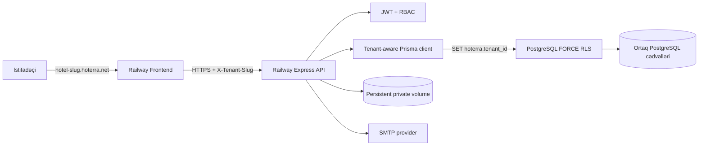
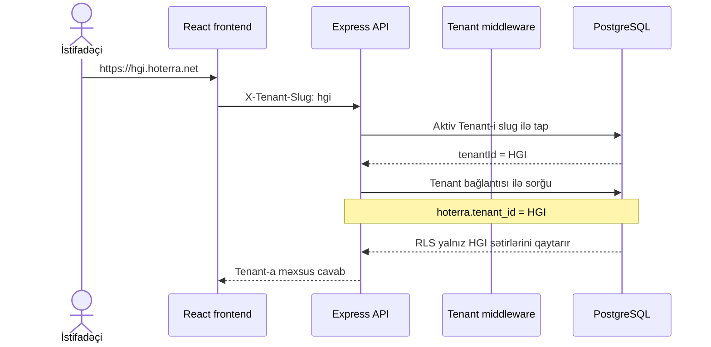
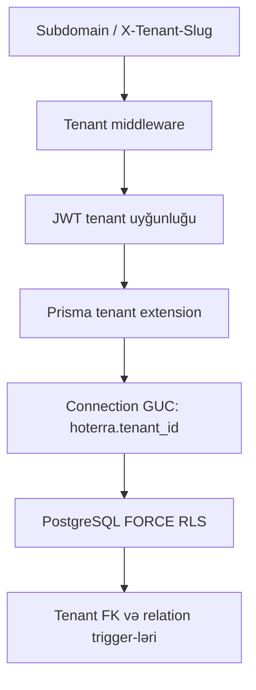
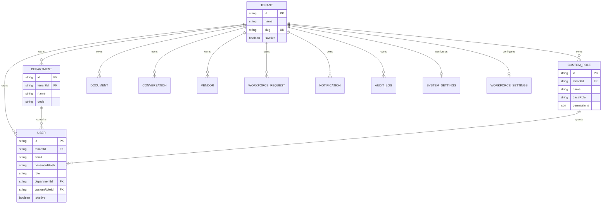
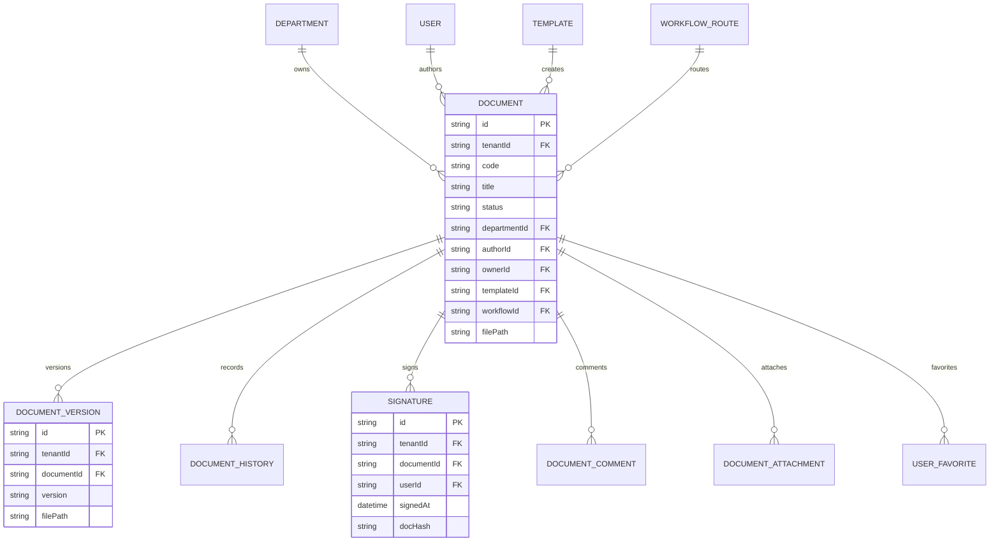
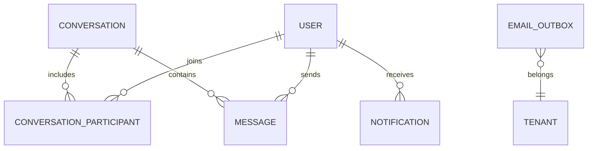

# HOTERRA verilənlər bazasının arxitekturası

Bu sənəd HOTERRA-nın production PostgreSQL sxemini, tenant (otel) izolyasiyasını və əsas biznes əlaqələrini göstərir. Mənbə: `prisma/schema.prisma` və `prisma/migrations`.

## 1. Arxitektura xülasəsi

| Mövzu | Həll |
|---|---|
| Database | PostgreSQL 17 + Prisma ORM |
| Tenant modeli | Bir database, ortaq cədvəllər, hər otel üçün `tenantId` |
| Tenant seçimi | `https://<slug>.hoterra.net` və `X-Tenant-Slug` |
| İzolyasiya | API filtri + PostgreSQL `FORCE ROW LEVEL SECURITY` |
| Əlaqə bütövlüyü | `tenantId NOT NULL`, `Tenant` foreign key-ləri və tenant relation trigger-ləri |
| Unikal sahələr | Tenant daxilində unikal: məsələn `(tenantId, email)` |
| Fayllar | Tenant prefiksli private storage, yalnız autorizasiyalı API ilə oxunur |
| Migration | Versionlanmış PostgreSQL migration-ları, production-da `migrate deploy` |

Hazırkı ilkin tenant:

- Otel: Holiday Inn Baku
- Slug: `hgi`
- URL: `https://hgi.hoterra.net`
- ID: `00000000-0000-4000-8000-000000000001`

## 2. Production topologiyası



Frontend və backend ayrıca servisdir. Database migration-ları backend deploy-dan əvvəl admin bağlantısı ilə icra edilir. Runtime backend isə superuser olmayan məhdud `hoterra_app` rolu ilə database-ə qoşulur.

## 3. Tenant necə müəyyən edilir?



Login-dən sonra JWT-də `tenantId` saxlanılır. JWT tenant-ı ilə hostname/header tenant-ı uyğun gəlməzsə sorğu rədd edilir. İstifadəçinin aktivliyi və cari rolu hər qorunan sorğuda database-dən yenidən yoxlanılır.

## 4. Müdafiə qatları

Tenant səhvi tək bir mexanizmdən asılı deyil:



- Bütün tenant cədvəllərində `tenantId` məcburidir (`NOT NULL`).
- `tenantId`, `Tenant.id`-yə `ON DELETE RESTRICT` foreign key ilə bağlıdır.
- RLS policy yalnız `current_setting('hoterra.tenant_id')` ilə eyni tenant sətirlərinə icazə verir.
- Runtime rolu PostgreSQL superuser ola bilməz; backend production startup zamanı bunu yoxlayır.
- Cross-tenant `departmentId`, `userId`, `vendorId` kimi əlaqələri ayrıca database trigger-ləri bloklayır.
- Migration/system bağlantısında kontrollu `hoterra.tenant_id=*` istifadə olunur.

## 5. Ümumi tenant sxemi



Əsas tenant-scope unique indekslər:

```text
Department        (tenantId, name), (tenantId, code)
User              (tenantId, email)
CustomRole        (tenantId, name)
Document          (tenantId, code)
Conversation      (tenantId, directKey), (tenantId, type, departmentId)
WorkforcePosition (tenantId, name)
Vendor            (tenantId, name)
WorkforceRequest  (tenantId, code)
```

Bu yanaşma fərqli otellərdə eyni email, departament kodu, vendor adı və sənəd kodunun istifadə olunmasına imkan verir, eyni otel daxilində təkrarı bloklayır.

## 6. Document Management sxemi



Fayl yolları database-də tenant prefiksi ilə saxlanılır. `/uploads` public static route deyil; sənəd və imza faylları yalnız `/api/files/...` üzərindən JWT, tenant və sənəd səlahiyyəti yoxlandıqdan sonra verilir.

## 7. Casual Workforce sxemi


Procurement vendor dəyişdikdə correction və review qeydləri ayrıca saxlanılır; Finance Director və General Manager təsdiqləri audit event-ləri ilə izlənir. Hər request item öz seçilmiş vendor və rate məlumatını saxladığı üçün bir request bir neçə vendorla icra oluna bilər.

## 8. Mesajlaşma və bildirişlər



Email birbaşa request thread-i içində göndərilmir. SMTP feature-i aktivdirsə əvvəl `EmailOutbox`-a `QUEUED` yazılır, background worker göndərir və `SENT`/`FAILED`, cəhd sayı, növbəti cəhd və son xəta saxlanılır. Feature söndürülübsə qeyd `DISABLED` olur və in-app bildiriş axınına təsir etmir.

## 9. Migration ardıcıllığı

```text
0_postgresql_baseline                 Mövcud PostgreSQL sxeminin baseline-i
20260824010000_tenant_integrity       NOT NULL, FK, tenant unique indeksləri
20260824020000_tenant_rls             ENABLE/FORCE RLS və policy-lər
20260824030000_email_outbox_delivery  SMTP outbox retry sahələri
20260824040000_tenant_relation_integrity Cross-tenant əlaqə trigger-ləri
```

Production deploy zamanı:

```mermaid
flowchart LR
    A[Railway pre-deploy] --> B[production-migrate.cjs]
    B --> C[Legacy tenant backfill]
    C --> D[Baseline detection]
    D --> E[prisma migrate deploy]
    E --> F[Backend start]
    F --> G[/api/ready]
```

`prisma db push` və `--accept-data-loss` production startup-da istifadə edilmir.

## 10. Database rolları

| Bağlantı | Dəyişən | Məqsəd |
|---|---|---|
| Admin/migration | `DATABASE_ADMIN_URL` | Schema migration, baseline, rol provisioning |
| Runtime app | `DATABASE_URL` | Yalnız tətbiqin gündəlik CRUD əməliyyatları |

Runtime istifadəçisi `NOSUPERUSER` olmalıdır. Onu yaratmaq üçün admin URL ilə:

```bash
npm run db:provision-app-role
```

Sonra `DATABASE_URL` məhdud istifadəçiyə, `DATABASE_ADMIN_URL` isə Railway secret olaraq admin bağlantısına verilir.

## 11. Backup və bərpa

Production database üçün Railway backup/PITR aktiv edilməli, periodik restore sınağı aparılmalıdır. Persistent upload volume ayrıca backup edilməlidir; database backup faylların özünü deyil, yalnız onların yollarını saxlayır.

## 12. Yoxlama əmrləri

```bash
npm run typecheck
npm test
npm run build:app
npm run db:migrate:deploy
npm run test:tenant-isolation
npm audit --omit=dev --audit-level=high
```

CI bu yoxlamaları PostgreSQL 17 service üzərində hər push və pull request üçün icra edir.
