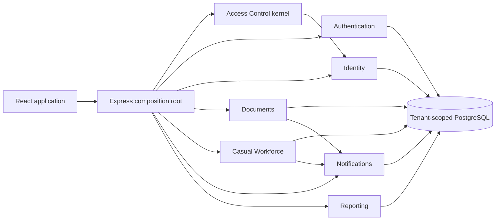

# HOTERRA Modular Monolith

## Decision

HOTERRA remains one deployable backend and one PostgreSQL database, but business logic is split into modules with explicit ownership. Existing `/api/*` contracts stay stable while legacy route files become thin HTTP adapters.

The backend migration is complete without a rewrite. A feature was moved only when its policy, application service, persistence access, and regression tests existed in the target module. Future work extends these module boundaries instead of adding business logic to `routes/`, `server/lib`, or the composition root.

## Runtime shape



## Directory contract

```text
server/
  index.ts                         # composition root only
  modules/
    access-control/
      domain/                      # capability vocabulary
      application/                 # effective permission resolution
      http/                        # authorization middleware
    authentication/
      application/                 # login, current account, token revocation
    identity/
      domain/                      # account hierarchy and invariants
      application/                 # safe DTOs/use cases
    documents/
      domain/                      # document/workflow invariants
      application/                 # object-level authorization/use cases
    workforce/
      domain/                      # vendor invite token invariants
      application/                 # request, vendor, payroll, reporting use cases
      infrastructure/              # tenant-aware recurring scheduler
    notifications/
      application/                 # actor-scoped inbox operations and safe destinations
    reporting/
      application/                 # tenant/user-scoped dashboard read models
    settings/                      # tenant settings/security/branding
    organization/                  # departments
    workflow/                      # workflow definition lifecycle
    templates/                     # document template lifecycle
    messaging/
      application/                 # scoped conversations, contacts, messages and attachments
    audit/                         # scoped audit read models
    search/                        # composed scoped search
    archive/                       # scoped archive inventory
    tenancy/                       # public workspace/branding discovery
  routes/                          # thin HTTP adapters; no persistence calls
  lib/                             # shared technical infrastructure only
```

Dashboard Reporting modulunun read modelidir və ayrıca `/api/dashboard/stats` HTTP adapteri ilə təqdim olunur. Documents routeri Dashboard statistikalarını daşımır; Documents və Workforce məlumatları yalnız öz modullarının public application facade-ları vasitəsilə kompozisiya edilir.

## Dependency rules

1. `domain` imports no Express, Prisma client, route, or UI code.
2. `application` may use domain contracts; persistence is supplied explicitly during later migration phases.
3. HTTP adapters authenticate, validate input, invoke one application operation, and serialize the result.
4. Modules do not import another module's route or repository implementation. Cross-module effects use a small public facade or an application event.
5. Tenant context and object scope are mandatory for every read and write. A capability never replaces tenant/department/ownership/workflow checks.
6. Frontend visibility is convenience only; the backend is the authorization authority.

## Authorization model

```text
effective access = authenticated tenant
                 + named capability
                 + object scope
                 + workflow/state transition guard
```

- System roles receive explicit named capabilities.
- An active custom role is resolved from its saved matrix; it can reduce access relative to its base role.
- `SYSTEM_ADMINISTRATOR` owns identity, privileged roles, security, tenant lifecycle, and technical settings.
- `GENERAL_MANAGER` has hotel-wide business oversight but cannot manage System Administrator accounts or technical security.
- HOD and Supervisor access is department-scoped, with explicit cross-department access only when they are the current approver/participant.
- Employees access their own, assigned, or published business objects—not tenant-wide administration data.

## Completed migration sequence

1. Access Control kernel and capability contract in `/auth/login` and `/auth/me`.
2. Identity safe DTOs and account hierarchy.
3. Documents object authorization and deterministic state transitions.
4. Workforce request visibility and Procurement/Finance scopes.
5. Frontend route/navigation/action guards.
6. Move route logic into module application services one use case at a time.
7. Introduce module-level repositories and transaction/event boundaries.
8. Enforce architecture with dependency tests after legacy business imports reached zero.

## Completed backend checkpoint

- Access Control, Authentication, Identity, Documents, Workforce, Notifications, and Reporting boundaries exist.
- Notification inbox operations and the dashboard read model run through application services.
- Pending document approvals are restricted to the actor's current workflow step.
- Document signing and approval decisions are atomic application services; evidence, state transition, history, audit, and notification share transaction boundaries.
- Document submission and every successful approval queue the exact next HoD/Finance Director/General Manager inside the same transaction. Recipient resolution requires the expected role/department and effective `documents.approve` plus `approvals.read` capabilities, so reduced custom roles do not receive unusable tasks.
- Document archive (single/bulk), restore, and version creation are lifecycle services with optimistic concurrency and transactional audit/history. Direct permanent deletion was removed in favor of the Archive module's independently reviewed records disposition use case.
- Document creation and editing are application services with department/owner scope, validated references, serialized code generation, optimistic concurrency, history, and audit.
- Document comments and uploads use actor-scoped services; storage cleanup compensates failed database writes and primary-file replacement cleans stale files.
- Vendor approval and rejection now use a Workforce application service with role/current-step enforcement, optimistic conflict detection, and transactional approval evidence plus audit logging.
- Procurement access resolution is centralized, and the unchanged-vendor “ready for execution” transition now atomically updates status, records evidence/audit, and notifies the request owner/department HoD.
- Vendor-correction draft creation and submission to Finance are Workforce application services with request locking, active-offer/invoice/state validation, transactional history/audit, and Finance notifications.
- Finance Director/General Manager correction decisions are handled by one locked transaction: return-to-Procurement, Finance-to-GM handoff, final line/vendor/price application, stale invite reassignment, audit, and HoD notification.
- Workforce request rejection, current-step revision return, and post-vendor-approval Finance return are actor-scoped transactional decisions with optimistic state checks, audit events, and creator notifications.
- The HoD/HR/Finance/GM request approval chain is an application service; final approval locks the request and atomically selects the lowest eligible approved offer per service line before handing it to Procurement.
- Procurement confirmation and initial vendor dispatch are one locked application transaction with centralized Procurement access resolution. Vendor/contact validation happens before the state transition, so the request cannot become `SENT_TO_VENDOR` without committed invites and email-outbox records.
- Vendor responses are accepted through tenant-scoped invite tokens; hotel-user impersonation controls were removed from the UI and simulation endpoints are restricted to an explicitly enabled non-production System Administrator tool.
- Public vendor accept/decline responses are idempotent, request-locked application operations; invite state, request state, activity, audit, and creator notification commit together.
- Service actuals, department HoD confirmation, and Finance completion are request-locked services; actuals become immutable after confirmation and all evidence/audit/notifications share the transaction.
- Cancellation is stage-scoped: creators may cancel only before vendor dispatch, Finance may cancel fully approved non-expired work, invoices block cancellation, and pending vendor invites close in the same audited transaction.
- Quality evaluation and replacement are vendor-specific for multi-vendor requests, department-scoped, audited, and preserve Finance as the only normal completion step; the five-low-HoD-score threshold notifies Procurement leadership, Finance, and GM atomically.
- Workforce payroll is an actor-scoped application service: invoice registration validates the assigned vendor and completed request, rejects negative/duplicate invoice data under advisory locks, multi-vendor matching uses each vendor's estimated share, and payment is impossible until a successful match. Registration, matching, and payment evidence are transactional and audited; payment time and actor are stored separately from matching time.
- Workforce settings updates are capability-gated, range-validated, serialized per tenant, and audited. Workforce admin tabs/actions use the same named capabilities; GM/Finance no longer inherit Procurement mutation or confirmation rights, catalog read-only mode hides mutation controls, and meta payloads omit approval routes/approver directories or unrelated budgets/templates outside the actor's scope.
- Workforce catalog position/vendor/rate mutations are Procurement-scoped application services with tenant-local duplicate locks, reference and value validation, and transactional audit evidence. Disabling a vendor also disables future rates, while material changes to an approved vendor reset its approval chain and notify the first signer instead of silently changing an approved record.
- Workforce approval-route and monthly-budget writes are separate named capabilities and locked application services. Routes validate active role/user/department references and always normalize to requesting HoD → custom steps → Human Resources HoD → Finance Director → General Manager; budgets reject invalid periods/negative or excessive amounts and retain transactional audit evidence. Finance can manage budgets without receiving route-editor access.
- Workforce templates have a dedicated capability and department object scope. References, quantity/day values, approved vendor state, duplicate active names, and every mutation are validated and audited under locks; deletion is a recoverable disable that also stops recurrence. Only hotel-wide Workforce settings managers may enable or manually run recurring automation, and ordinary HoDs do not see those controls.
- Workforce reports and CSV exports now share one actor-scoped read model and validated period contract. System/GM/Finance and authorized Procurement viewers receive hotel-wide data; all other report users are restricted to their department. HoD payment rows redact vendor identity until the request reaches the fully-approved stage, CSV export has its own capability, UTF-8/Excel-safe output, and an audit download record.
- End-date lifecycle reconciliation is an explicit scheduled Workforce application use case. It conditionally advances eligible orders to final evaluation inside a transaction and records activity, audit evidence, and HoD notifications; request list/detail GET operations are now side-effect free.
- Workforce request creation and HoD revision/resubmission are locked planning application services. They enforce named capability plus department scope, bounded periods/lines/quantities/hours, approved catalog offers, normalized HoD → HR HoD → Finance Director → General Manager routing, budget/lead-time checks, collision-safe request codes, and transactional event/audit evidence. Resubmission invalidates stale vendor invites/corrections and cannot rewrite a request that already has invoices.
- Workforce request list/detail reads now share an actor-scoped read model. Hotel-wide oversight and Procurement scope are explicit; other users receive only owned, department, current-approval, or participated requests. Filters are validated, query candidates are bounded, vendor details stay hidden from department users until Procurement finalization, and vendor portal bearer tokens are never serialized to authenticated hotel clients.
- Recurring request generation is a tenant-local, timezone-aware application use case. Each template occurrence is guarded by a transaction advisory lock, request creation and `lastGeneratedAt` commit atomically, generated requests reuse the same validated planning path, and the department HoD becomes the accountable creator where available. Manual execution affects only the authenticated tenant; only the infrastructure scheduler explicitly iterates active tenants under separate tenant contexts.
- Vendor dispatch/resend is a Procurement-scoped locked application service. Assigned vendors and real contact emails are validated, initial confirmation, invite creation/token rotation, email-outbox rows, activity, and audit evidence commit together. Resend expires the old bearer link and issues a new 256-bit token; fabricated fallback email addresses and no-op resends were removed. Authenticated hotel DTOs never receive these tokens.
- Development-only vendor response simulation is isolated behind both a runtime feature flag and System Administrator authorization. Invite selection lives in an application service, while the simulated actor evidence is written inside the same locked vendor-response transaction; production routes cannot enable or impersonate this path.
- Workforce meta is an actor-scoped read model. Vendor, approval-route, budget, template, and approver queries are restricted before database access; department users receive only anonymous lowest eligible rates with no vendor metadata. The GET endpoint is side-effect free and returns safe defaults instead of creating settings rows.
- Vendor create/resubmit/step approval and their next-signer notification/email-outbox rows now commit in the same transaction. Notification failures can no longer be swallowed after advancing the vendor approval state. Final request approval also records the Procurement handoff notification in the lowest-offer-selection transaction.
- Manual, revised, intermediate-approved, and recurring workforce requests queue the current approver's push/email rows inside the request transaction. The legacy post-commit `notifyApprovers` helper was removed, so a request cannot be created or advanced without its corresponding notification evidence.
- Email-outbox diagnostics use an explicit System Administrator-only DTO. Email bodies are not selected because vendor messages contain bearer portal links; GM keeps business settings access but the technical outbox panel is hidden from non-system administrators.
- The former Workforce god-helper was removed. Request DTO serialization, current-step approval policy, report aggregation, and scheduling are owned by the Workforce module; unused mutations and permissive legacy role checks remain deleted.
- Development-only vendor impersonation endpoints live in a separate HTTP adapter and are registered only when the non-production feature flag is enabled. Production no longer exposes placeholder simulation routes, while System Administrator authorization and application-service checks remain defense in depth.
- Workforce Payroll has its own capability-gated HTTP adapter. Invoice list, registration, matching, and payment routes retain their public URLs while the main Workforce composition router no longer owns payroll error mapping or transport details.
- Workforce report JSON and CSV endpoints share a dedicated HTTP adapter with separate read/export capabilities. The actor-scoped report application service remains the single data source, and CSV response headers/error mapping no longer leak into the main composition router.
- Workforce operational controls use a dedicated adapter: email-outbox diagnostics remain System Administrator-only and recurring execution requires hotel-wide Workforce settings capability. The adapter exposes no shared middleware that could accidentally gate unrelated Workforce routes.
- Procurement catalog transport is isolated from request workflow transport. Position, vendor, vendor-approval, and rate endpoints use the catalog application services and a shared HTTP notification-options factory, preventing per-router email/outbox configuration drift.
- Workforce configuration transport is isolated from request lifecycle transport. Meta bootstrap, settings, approval routes, budgets, and templates keep distinct named capabilities in a dedicated adapter, leaving the main composition route focused on request workflow orchestration.
- Workforce request planning has a dedicated adapter for scoped list/detail reads, creation, and HoD revision/resubmission. Mutation responses share one actor-scoped detail helper, keeping vendor-token redaction and object visibility consistent across planning and workflow adapters.
- Workforce approval decisions have a dedicated adapter for approve, reject, current-step revision return, and Finance-to-HoD return. Role middleware remains an outer guard while locked application services remain authoritative for current-step and object-state decisions.
- Procurement fulfillment has a dedicated adapter for initial confirmation/dispatch, vendor-correction draft and Finance/GM review, unchanged-vendor finalization, and invite resend. All mutation responses still pass through the actor-scoped request detail read model.
- Workforce service lifecycle has a dedicated adapter for vendor evaluation/replacement, actuals submission, HoD/Finance completion confirmation, and stage-safe cancellation. The main Workforce router is now composition-only and contains no business endpoint handlers.
- Document list, pending-approval inbox, dashboard stats, CSV export, detail, and related-document reads now use a dedicated query adapter. It applies the existing actor-scoped document policies before database access and shares secret-safe comment/tag formatting with mutation adapters.
- Document signature evidence and approval decisions now use a dedicated workflow adapter. Signing remains evidence-only, explicit approval advances the state machine, and role/current-step enforcement stays authoritative in the transactional application services. Evidence stores the exact document version and approval cycle plus a real SHA-256 digest over the tenant-private source file or canonical content/metadata payload. Returned/restored/new-version cycles cannot reuse old signatures; detail DTOs expose only current-cycle evidence, and document metadata or the primary file cannot change after review starts.
- Document creation and metadata updates now use a dedicated content adapter. Department/owner assignment policy, reference validation, workflow locking, optimistic concurrency, and version rules remain inside the application service.
- Document archive/restore, bulk archive, version creation, and permanent deletion now use a dedicated lifecycle adapter. State checks, optimistic conflicts, history, and audit evidence remain transactionally enforced by the application service.
- Document comments, comment attachments, moderation, and primary/attachment uploads now use a dedicated collaboration adapter. Tenant-prefixed storage, authorization, failed-write compensation, and stale-file cleanup remain enforced. The root Documents router is now composition-only.
- Identity account creation and updates now use a locked application service. Email uniqueness, active custom-role and department references, privileged-role assignment, self-demotion/deactivation protection, last-active-System-Administrator preservation, password-reset capability, safe DTO output, and audit evidence are enforced in the transaction. Account activation/deactivation rotates `tokenVersion`, so a JWT issued before suspension cannot revive after reactivation; lifecycle managers can see inactive accounts while ordinary directory readers remain active-only and department-scoped.
- Identity directory/profile reads are actor-scoped application read models: HoDs remain department-bound, recent documents reuse document visibility policy, and profile audit activity is limited to self or `audit.read`. Signature replacement is locked and audited, compensates failed storage writes, and cleans the previous image after commit. User responsibility counts are exposed through a safe account-lifecycle query and router specificity is preserved by mounting lifecycle routes before the generic `/:id` query adapter. The responsive directory uses capability-aware mobile cards and separates custom-role filtering from base-role filtering; profile access failure has an explicit safe state. The root Users router is composition-only.
- Messaging endpoints now require the named `messages.use` capability at the router boundary. Hotel/department chat provisioning is an explicit locked POST application use case; conversation list and unread-count GETs are side-effect free. Client polling pauses for hidden tabs, prevents overlapping cycles and marks a conversation read only on opening or a genuinely new incoming message instead of writing every five seconds.
- Message listing, sending, attachment access, and read acknowledgement now use actor-scoped application services. Sending is conversation-locked and transactional, attached documents are redacted per recipient policy, storage writes are compensated on failure, and audit evidence never includes private message content.
- Conversation list/unread reads and direct-chat creation now use dedicated Messaging services. Direct creation is tenant-locked, race-safe, participant-complete and audited; list previews redact inaccessible document titles and bound direct-chat fan-out. The root Conversations router is composition-only.
- Tenant Settings now has separate query, business/branding, and security/maintenance adapters. GET operations are side-effect free; missing rows use in-memory defaults, and readers without `settings.manage.security` receive only business-safe extended sections.
- Business Settings updates whitelist tenant/document/notification fields and business-owned extended sections, serialize slug changes with advisory locks, enforce reserved/unique subdomains, and commit tenant metadata, settings, and audit evidence together. A General Manager can no longer mutate security, storage, integration, backup, or licensing configuration through the generic settings payload.
- Security Settings uses a dedicated System Administrator capability and endpoint. Security/infrastructure updates preserve operational timestamps, index version, and organization identity; maintenance operations create missing defaults safely and commit their audit evidence in the same locked transaction.
- Login branding replacement/reset is a storage-aware application service. Failed database writes remove newly uploaded files, successful replacements clean stale tenant assets, and branding state plus audit evidence commit atomically.
- Custom-role directory and lifecycle now belong to Access Control application services. System-role counts exclude custom-role users, while custom-role counts show every assignee so deactivation risk is visible; the root Roles router is composition-only.
- Custom-role create/update/deactivate operations are advisory-locked and audited. Permission matrices require real booleans, delegated role managers cannot grant capabilities they do not hold or edit their own assigned role, executive base roles require privileged assignment authority, and duplicate names return deterministic conflicts.
- Role deletion is recoverable deactivation and is blocked until every active or inactive assignee is moved, preventing later account reactivation from falling through to an unintended base role. Inactive roles are visible only to role lifecycle managers and have an audited locked reactivation use case; reactivation also fails while any legacy assignee remains so permissions cannot silently change. General Manager and System Administrator account/role assignment is protected from delegated identity managers on the backend, matching the frontend's executive-role restrictions.
- Department directory/detail reads and mutations now belong to the Organization module. The root Departments router is composition-only; detail access uses named capability plus own-department or hotel-wide document scope instead of legacy role checks.
- Department list aggregation removes the per-department document-count query, counts/displays active staff only, returns explicit DTOs, and exposes staff email only to users with directory permission. Ordinary actors are department-scoped inside the Organization read model; hotel-wide document/organization managers and user provisioners receive the directory scope they need. Each result carries an authoritative `canOpen` decision so directory access cannot become a dead or unauthorized business-detail link. Detail payloads select the document/template fields used by the screen instead of serializing stored file/content fields.
- Department create/update operations validate bounded names, immutable normalized codes, locations, descriptions, and hex colors; case-insensitive duplicates are serialized and return deterministic conflicts. State and audit evidence commit in one transaction, while Add/Edit/Workflow/Template controls are capability-hidden in the frontend.
- Workflow queries and mutations now belong to the Workflow module, with a composition-only root router and separate read/manage adapters. Names and definitions are bounded, case-insensitive duplicates are serialized, and every lifecycle mutation is audited.
- Workflow activation is restricted to the exact HoD → Finance Director → General Manager chain currently implemented by the document state machine. Design-only step types remain draft-only, active steps are immutable, and document creation rejects draft or archived routes.
- Default workflow replacement is transactionally serialized and cannot be cleared without selecting another active route. Deletion is recoverable archival, default routes cannot be archived, and historical document references are retained.
- Workflow management actions and Designer navigation are hidden without `workflows.manage`; read-only users receive the workflow inventory without mutation affordances.
- Document Templates now have a dedicated module with department-scoped policy, content-free bounded list DTOs, detailed reads, and separate query/management adapters behind a composition-only root router.
- Template writes validate bounded metadata, category/version/status, active department references, page count, and every signature zone. Case-insensitive duplicates are serialized per department, and mutation state plus audit evidence commit together.
- Template deletion is recoverable archival and retains historical document references. Only canonical active templates can seed new documents; draft, review, inactive, and archived templates are rejected server-side and filtered from document creation.
- Template actions are hidden by capability and object scope. The editor now manages description, category, version, lifecycle status, department assignment, and safe signature parsing; template CSV export is functional and spreadsheet-injection safe.
- Global Search delegates template lookup to the actor-scoped Template read model, returning summary DTOs instead of raw content/signature definitions; read-only result links no longer lead to protected editors.
- Global Search now has a dedicated application read model and composition-only HTTP adapter. Queries are length-bounded, filter enums/IDs are validated, and every result family is omitted unless the actor holds its named read capability.
- Document search intersects text/file/date/author/department filters with `documentReadScope` and returns an explicit DTO without content, storage paths, signature layouts, or internal tenant fields. User, department, template, workflow and Casual Workforce lookup delegates to authoritative scoped modules. Workforce search reuses `canViewWorkforceRequest`, status-based vendor disclosure and a token-free lightweight DTO.
- The Documents list text-filter scope bypass was closed: free-text predicates are now added through `AND` instead of overwriting the policy's ownership/department/published `OR` predicate.
- Search UI tabs and detail links follow effective capabilities/object scope. Department filters use real IDs, server filters and sorting are functional, fake saved searches were replaced with per-user local saved queries, and dead result action buttons were removed.
- Primary and attachment document files now have a Documents-owned extraction pipeline and tenant-scoped multi-source `DocumentSearchIndex`. TXT/CSV/PDF/DOCX/XLSX extraction is size/page/cell bounded, parser failures do not roll back valid uploads, replacement jobs use a stale-write guard, and a bounded per-tenant scheduler backfills pre-existing or interrupted files. Search intersects extracted text with `documentReadScope`, identifies matched attachment names and returns only match/status metadata, never extracted content or storage paths. Images/scanned PDFs explicitly require OCR and legacy DOC/XLS are not misrepresented as indexed. Primary and attachment mutations are both frozen once review begins.
- Search-index operations remain owned by Documents while their HTTP controls are exposed through Security Settings. Only `settings.manage.security` can read tenant aggregate health, queue a full rebuild, retry failed rows, or run a bounded batch. The operational projection deliberately contains no document metadata, file names, storage paths, or extracted text; every manual retry/batch is audit-evidenced and OCR-required sources stay local until an approved provider is configured.
- Audit Log now has a dedicated read model and composition-only router. Filters, dates, pagination, action/entity/module/severity values, tenant predicates, and result windows are validated server-side; department/category/template filters resolve related document, workforce, attachment, and comment evidence before querying. List/export responses use explicit DTOs, exports are UTF-8 and spreadsheet-injection safe, and every export creates its own audit evidence.
- Audit module classification is entity-aware instead of treating every generic CREATE/UPDATE event as a document action. System, document, approval, archive, template, organization, identity, workforce, and messaging events can be filtered consistently, while high-severity summaries use the same catalog as row presentation.
- Audit evidence is tenant-chained in PostgreSQL: a serialized insert trigger assigns sequence/previous hash/SHA-256 entry hash, while the runtime role has no update/delete privilege and production startup rejects a mutable AuditLog grant. Opening Audit Log writes its own `VIEW` evidence before verifying the complete tenant chain; the UI receives only aggregate status, count, sequence and anchor, never hidden event payloads. A server-owned request context assigns every HTTP call a UUID shared by the response header, structured operational log and all audit writes inside that async flow. V3 canonicalization protects request correlation plus outcome/reason/before/after state. Identity account, custom-role, Organization Department, Templates, Workflows, Documents and Security Settings application services use deterministic allowlisted snapshots. Department lifecycle records state transition, reason and transfer counts/target without employee identity. Template/document content, document descriptions/file names/storage paths and workflow definitions stay out of clear-text snapshots; SHA-256 digest plus bounded structure/lifecycle summaries prove their changes. Document create/update/review, decision, signature, primary/attachment upload, archive/restore/version and bulk archive are covered; signature state is tied to exact version/cycle. Default-workflow replacement records the old and new tenant default ID set. A shared sanitizer omits credential, token, PIN/password, signature image and storage-path fields. Normal list/CSV projections expose only whether a structured change exists, while the separately authorized JSON evidence package carries the complete verifiable snapshot and stable chain cutoff. Filtered/truncated exports are explicitly marked. Test cleanup never deletes audit rows; temporary actor records remain inactive when their FK identity must be retained. The schema/migration owner remains an explicit offline break-glass boundary.
- Document Favorites now belong to the Documents application boundary. Favorite list queries intersect the current user's ownership with `documentReadScope` inside the database, favorite detail DTOs omit content/storage/internal tenant fields, inaccessible IDs remain concealed, and add/remove/check operations require the same named document-read capability.
- Archive is a server-side actor-scoped Records Management module with validated search/type/pagination, exact scoped totals, retention policies, legal holds, disposition queues, storage usage, and disposed-record evidence. Templates appear only with template-read access. Restore, policy/hold management, disposition request, independent approval and export have separate capabilities. Approved disposition purges content/files while retaining a `DISPOSED` tombstone, request snapshot, history, and audit evidence; requester self-approval is rejected.
- Template restore is an explicit locked lifecycle operation. It accepts archived templates only, detects active-name conflicts, restores as an inactive draft for review, and records audit evidence instead of silently making old content active.
- General Reports now belong to a dedicated Reporting read model with a composition-only router and separate read/export capabilities. Date ranges and comparison modes are validated, every document/history/attachment aggregate intersects `documentReadScope`, active-user counts follow hotel or department scope, and report activity no longer exposes unrelated hotel-wide audit events.
- Report date filters, previous-period/year comparison, approval outcomes, department/category breakdowns, storage-added trend, warning limits, and CSV export are real server data. Static 2025 dates, fabricated percentage changes, mock report history, fake storage charts, placeholder approval panels, and dead detail/export controls were removed.
- Report CSV output is UTF-8 and spreadsheet-injection safe; exports create a `Report` audit event. The UI independently hides export without `reports.export` and links recent scoped document activity only to objects returned by the authorized read model.
- Runtime database isolation no longer recognizes `hoterra.tenant_id=*`. The system client uses a non-matching `__system__` sentinel for the non-RLS tenant registry/health checks, production startup rejects superuser or `BYPASSRLS` roles and wildcard policies, and schema/backfill migration work is confined to the admin pre-deploy path.
- Authentication login/current-account/logout logic now belongs to an application module. JWTs carry the account's database token version; logout and password reset atomically increment that version, so captured or parallel bearer tokens stop working across processes and restarts.
- Private file delivery now requires both the canonical document policy and an active-tenant storage prefix. Primary files and attachments obey `allowDownload`, document signature evidence requires document read access, and a user's reusable signature image is readable only by that user.
- Shared upload infrastructure treats names, extensions and MIME declarations as untrusted. It stores only a normalized basename, derives a canonical MIME from an allowlisted extension plus verified PDF/Office/text/image content signature, and rejects mismatches before any tenant-private file is written. Identity signature storage uses the stricter image-only path. This is a format trust boundary; external malware scanning/quarantine remains a separate production integration.
- API throttling uses two boundaries: a high IP safety ceiling and a tighter SHA-256 bearer-fingerprint session bucket. Raw bearer credentials never enter limiter memory/logs, separate staff sessions behind the same hotel NAT cannot exhaust each other, and login/vendor portal routes retain narrower purpose-specific limits. Multi-instance/global enforcement remains an edge WAF or shared-store infrastructure concern.
- New vendor portal links store only a SHA-256 token digest in the database. Legacy links remain temporarily readable during migration, expired links no longer disclose order details, public response endpoints are rate limited, and no portal response serializes the stored token.
- Document list, detail, approval-history, related-document, and CSV reads now share an explicit Documents read model. Query values and result windows are validated, every query intersects object scope, approval tabs are actor-specific, and DTOs omit tenant IDs and private storage paths.
- Document CSV export rejects silent truncation, quotes every cell, neutralizes spreadsheet formulas, and records an audit event. Document detail/list actions now mirror create, update, archive, export, workflow, download, and comment capabilities plus department/object scope; unauthorized directory filters are not fetched or rendered.
- Document mutation adapters now require read plus their named mutation capability and return the same secret-safe detail DTO after create/update/archive/restore/version/approval/upload. Attachment uploads expose only download metadata, while signing responses omit IP address, device, and reusable signature storage paths.
- Custom-role capability resolution enforces read prerequisites defensively, and role writes reject mutation/export/manage permissions without the module's Read permission. The role editor keeps the matrix consistent by selecting Read automatically and clearing dependent permissions when Read is removed.
- Document creation now loads department, owner, template, and workflow directories only when the actor has each read capability, with own-department/self fallbacks. Fabricated sample data, ignored public/notification/acknowledgement controls, dead cover/editor controls, and the incorrect 25 MB/PPTX upload promise were removed; category edits and template/workflow reference permissions are enforced server-side.
- Document code generation uses an executable transaction advisory lock. A local API/PostgreSQL E2E protects document submission, HoD inbox deep-linking, Dashboard `My Work`, and fixture cleanup from regressions.
- Private primary files, attachments, document-signature evidence, and reusable user signatures now resolve through Documents/Identity application services with tenant, object, download, and owner policy checks. The Files HTTP adapter performs no direct Prisma query; all persistence access in `server/routes` is now delegated to module application services/read models.
- Reusable signature replacement is strictly self-service. Account administrators, General Managers, and System Administrators cannot upload or replace another employee's signing evidence; every replacement remains storage-compensated and audited as the signer's own action.
- The public vendor portal now uses an explicit token-authenticated Workforce read model and no longer depends on the legacy `workforceVendor` adapter. Expired links disclose no order data, bearer tokens are never serialized, and bulk requests show only the invited vendor's assigned service lines with period, quantity, unit, rate, and estimated cost; decline requires a recorded reason in the UI.
- Tenant-local Workforce lifecycle reconciliation and recurring generation are composed by a Workforce application service. The manual operations HTTP adapter no longer calls the infrastructure scheduler helper; the scheduler remains responsible only for tenant iteration, timing, and operational logging.
- Workforce request list/detail DTOs are recursively sanitized by the Workforce read model. Nested tenant identifiers, bearer tokens, private storage paths, and credential fields can no longer leak through included vendor, rate, position, item, invoice, evaluation, or correction relations.
- All frontend operations now use an application-owned accessible dialog service instead of native browser alerts, confirms, or prompts. Signing PINs are masked, focus is trapped/restored, Escape and keyboard submission work, and mobile dialogs render as touch-friendly bottom sheets. Destructive archive/vendor/rate/branding/payment and automation operations require explicit confirmation; document bulk approval processes every selected item and archive controls follow effective capability.
- Workflow Designer no longer offers design-only step types as if they were executable. Users can add only runtime-supported approval/sign steps, and activation requires an explicit confirmation before the draft route becomes immutable.
- Notification and Dashboard read models now return explicit public DTOs instead of spreading persistence records, preventing tenant ownership and user-key fields from leaking to clients. Workforce notifications have a dedicated visual filter and retain capability-checked same-origin destinations.
- Notification clicks are resolved server-side before navigation. The notification must belong to the actor, its route must pass the capability allowlist, and document/workforce object links are rechecked through the authoritative module read model; revoked, deleted, or out-of-scope targets become a metadata-safe `Item unavailable` result while the dead alert is cleared from the unread queue.
- Actionable notifications now support typed `entityType`, `entityId`, `actionType`, `dedupeKey`, expiry, and completion evidence alongside the legacy display link. Document approval rows are cycle/step deduplicated; document, Workforce, vendor, and Procurement decisions complete the actor's matching notification inside the business transaction. Opening an already-finished approval returns `COMPLETED` and retains a read-only deep link instead of presenting a stale action as pending.
- Workforce vendor-correction review/revision and final-evaluation alerts use the same typed lifecycle. Finance/GM decisions and Procurement resubmission complete their own action rows atomically; open-time reconciliation reuses the authoritative Workforce `My Work` policy so another eligible user's completed task cannot remain falsely actionable. Final-evaluation notifications go only to capability-eligible HoDs of the owning department, not to a non-HoD creator who cannot perform the evaluation.
- Notification delivery preference is user-owned rather than a disguised tenant Settings mutation. Every user may read/update only their personal email preference, the change is audited, and Workforce approval/vendor email queues honor both the hotel-wide channel switch and the recipient's preference. Assigned in-app work remains mandatory; unavailable browser-push/SMS controls are explicitly disabled instead of claiming delivery support.
- Dashboard `My Work` composes actor-scoped document approvals, author/owner `NEEDS_REVIEW` revisions, and Workforce current-step approvals. It reuses each module's authoritative authorization policy, gives returned documents an explicit `Revise and resubmit` action, prioritizes overdue/returned/nearest-due actions, and preserves cross-module representation in the bounded queue.
- Workforce `My Work` continues beyond initial approval: exact-step HoD/HR/Finance/GM approval, Procurement selection confirmation, Procurement correction revision, Finance/GM vendor-change review, department HoD final vendor evaluation/service confirmation, and Finance completion are derived from the same application policies as their mutations. The former GM read-model override was removed, so UI `canApprove`, pending lists, Dashboard tasks, and backend decisions agree on the exact current actor.
- Global badge and header-panel queries are capability-aware, avoiding background 403 traffic and accidental probing of inaccessible modules. Mobile navigation has a direct notification entry, dynamic touch-target columns, and a capability-gated Messages entry in the full menu.
- Dashboard document counts, status/department charts, Recent Activity, and Upcoming Reviews use a responsibility scope distinct from broad published-document readability: `documents.read.all` remains hotel-wide, while other actors receive only author/owner/department objects. Technical System Administrators receive no document business feed. Recent Activity opens the related authorized object directly. Message previews deep-link to a conversation only after the actor-scoped Messaging directory confirms that the requested conversation belongs to the signed-in user.
- Login token persistence now follows the visible Remember me choice. The secure default uses session storage, persistent storage requires explicit opt-in, and login/logout/401 handling clears both locations to avoid stale parallel tokens.
- Tenant security session lifetime is enforced when a JWT is issued: the validated 5–1440 minute setting becomes the token's server-verified expiry instead of remaining a display-only value. Existing tokens retain their original signed expiry.
- Tenant password policy is authoritative for account creation and administrative password reset. Basic, Strong, and Enterprise composition rules share one Settings-module policy service, configurable minimum length is bounded to 8–128, and password resets still revoke every existing token.
- Security controls fail closed and report their real runtime state: because MFA challenge and CIDR enforcement providers are not implemented in this release, 2FA/IP flags are forced off, existing misleading values are removed by migration, and Settings presents both as Not configured rather than falsely claiming protection.
- System Administrator is a technical tenant role rather than an implicit hotel executive. Its default capability set is limited to identity/role administration, tenant/security settings, department directory, technical audit and notifications; document signing/approval, Workforce/vendor/invoice operations, business reports and employee messaging are excluded. Backend-issued capabilities and the frontend legacy-session fallback share the same contract.
- Production tenant resolution is fail-closed. Requests to the shared API host must carry `X-Tenant-Slug`, while a valid `<slug>.hoterra.net` host may supply the context directly; absent/ambiguous context returns `TENANT_REQUIRED` instead of silently falling back to HGI. The default tenant remains available only for local development and the desktop fixture.
- Login exposes only authentication methods that exist at runtime. Non-functional Microsoft/Google controls, the dead language button, and unverified ISO/GDPR certification claims were removed; the page keeps password authentication and describes only enforced tenant isolation, audit and workflow controls. OAuth controls must remain absent until a provider callback/session flow is implemented and integration-tested.
- The System Administrator/business separation is enforced inside Workforce application services as well as at HTTP capability gates. Technical administrators are not treated as approval, vendor-correction, procurement, evaluation, cancellation, actuals, reporting, template or request-planning overrides. Recurring requests require an accountable department HoD, and current-step notifications go only to the explicitly assigned user or exact role/department instead of copying GM/System Administrator into every approval.
- Workforce approval and fulfillment preserve separation of duties for executives too. General Manager can decide only the actual GM step and cannot impersonate HoD, HR HoD or Finance Director; quality evaluation belongs to the request department HoD, replacement initiation belongs to that HoD or Procurement, service actuals belong to HoD/Procurement, HoD confirmation belongs to the department HoD, and final actuals confirmation/cancellation authority remains with Finance under the documented state/date rules.
- Workforce mutations are also capability-deny-by-default for active custom roles. Decision, procurement and lifecycle adapters require `workforce.read`, while their application services independently reject actors whose effective role matrix removed module access; retaining a matching base role is no longer enough to call approval, vendor review, evaluation, actuals or cancellation commands.
- Procurement authorization no longer interprets raw `CustomRole.permissions` array indexes. The helper requires the actor's server-resolved `workforce.vendor.manage` capability plus an active Procurement department account; Procurement HoD confirmation separately requires effective `workforce.read`. Deactivated roles and failed Read prerequisites therefore cannot regain mutations through a second permission parser.
- Legacy role-only document helpers were removed from authentication middleware. Document access now has one authoritative object-policy/read-model path; future adapters cannot accidentally import a dormant `SYSTEM_ADMINISTRATOR`/role-list bypass instead of named capabilities and object scope.
- Public workspace discovery and login-branding metadata now belong to a Tenancy module. The public HTTP adapter performs no tenant-registry query, exposes an explicit storage-path-free DTO, and obtains branding assets only after the application service verifies the selected tenant's `/uploads/<tenant>/branding/` prefix. Route boundary tests now reject every direct `prisma.*` or `systemPrisma.*` persistence call, not just a model allowlist.
- Workflow step parsing, validation, normalization, summaries and DTO formatting moved from the legacy `server/lib` folder into a framework/persistence-independent Workflow domain. Workflow internals use the domain directly, while Documents and Organization consume only the Workflow module's public `index.ts`; boundary tests prevent the legacy helper from returning.
- Document signature placement and signer-state rules are owned by the framework/persistence-independent Documents domain; Templates consumes only the Documents public facade.
- Extended settings merge/default rules and permission matrix catalogs are owned by Settings and Access Control respectively, rather than root-level business files.
- Automated module-boundary tests prevent domain code from importing Express, Prisma, the database, or routes; require a public `index.ts` for every module; reject deep cross-module imports; reject persistence calls in HTTP routes; and allow only shared technical infrastructure in `server/lib`.
- HTTP adapters are thin and persistence-free. The explicitly development-only vendor simulation adapter stays isolated and conditionally registered.
- The local authorization and Workforce E2E harnesses now share the seed credential contract. Workforce E2E exercises the complete HoD → HR HoD → Finance Director → General Manager → Procurement → public vendor portal → correction review → actuals → payroll lifecycle, asserts that authenticated DTOs never expose vendor bearer tokens, and cleans tenant-scoped fixtures plus the temporary Front Office route before and after each run. Direct outbox verification and cleanup refuse non-local PostgreSQL hosts.
- PostgreSQL isolation E2E now covers Department, User, Document, WorkforcePosition and WorkforceRequest reads, explicit tenant-id override, cross-tenant update/relation attempts, tenant-local unique values and the `__system__` sentinel. Local startup and the test bootstrap use the provisioned `NOSUPERUSER NOBYPASSRLS` application role, while setup/cleanup stays on the admin connection; remote execution requires explicit staging opt-in.
- Identity owns public account/session and user profile projections. Reusable signature storage paths stay internal to the owner-only file/signing use cases; session DTOs expose only `hasSignature`, minimum department/custom-role fields and effective capabilities. User directory/profile document metadata is intersected with the Documents module's public `documentReadScope`, while audit summaries require owner or `audit.read` access. Frontend profile tabs and directory aggregates mirror those named capabilities and no longer present fabricated workflow assignments.
- Identity lifecycle mutations fail closed across module-owned responsibilities. Before deactivation or a role/custom-role/department scope change, the transaction checks incomplete typed action notifications plus the current owner (or author when unassigned) of Documents `NEEDS_REVIEW` work. A read-only responsibility summary exposes category counts to the lifecycle UI without disclosing business object content. Workforce `RETURNED_FOR_REVISION` creation is deliberately not treated as exclusive ownership because the authoritative policy permits another eligible department HoD to revise it. Technical identity administrators cannot bypass separation of duties by reassigning business objects; conflicts must be completed or formally handed over in their owning module before access is removed. Token revocation remains atomic with a permitted lifecycle transition.
- Identity models permanent employee `jobTitle` as mandatory tenant-owned descriptive data, separate from base/custom access roles and from the Workforce vendor-service position catalog. Capability and hierarchy resolution never consume the title. Session, directory, organization and profile DTOs expose it explicitly; Documents snapshots the current title into new signature evidence so later personnel updates cannot rewrite historical approvals.
- Organization owns a recoverable Department lifecycle. Deactivation is serialized and fails closed on open employee tasks, document/workforce processes, active templates, recurring configuration, or catalog positions. Once clear, active users move atomically to an explicitly selected active department, their sessions are revoked, source department-chat membership is removed, and notifications plus audit evidence commit with the state change. Inactive departments remain historical references but are excluded from ordinary directories and rejected by new Identity, Documents, Templates and Workforce assignments; managers can inspect dependencies and reactivate with a recorded reason.

## Definition of done for a migrated use case

- Permission and object-scope decisions are server-side and covered by deny/allow tests.
- Tenant isolation is preserved.
- State changes are transactional, idempotent where relevant, audited, and notify the correct recipients.
- Response DTOs are explicit and contain no secret/internal fields.
- Existing URL/API compatibility is maintained or versioned deliberately.
- Typecheck, unit/integration tests, and a role-based browser smoke test pass.
